<!DOCTYPE html>
<html>
  <head>
    <title>Experiment = CelebAMask_512_48_mp_more_deform_aug_genfeat, Phase = test, Epoch = latest</title>
  </head>
  <body>
    <h3>00000000</h3>
    <table border="1" style="table-layout: fixed;">
      <tr>
        <td halign="center" style="word-wrap: break-word;" valign="top">
          

             
            
input_label

          

        </td>
        <td halign="center" style="word-wrap: break-word;" valign="top">
          

             
            
synthesized_image

          

        </td>
      </tr>
    </table>
    <h3>00000001</h3>
    <table border="1" style="table-layout: fixed;">
      <tr>
        <td halign="center" style="word-wrap: break-word;" valign="top">
          

            <a href="images/00000001_input_label.jpg">
              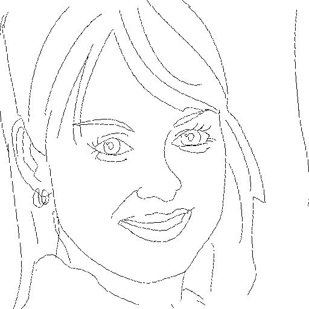
            </a> 
            
input_label

          

        </td>
        <td halign="center" style="word-wrap: break-word;" valign="top">
          

             
            
synthesized_image

          

        </td>
      </tr>
    </table>
    <h3>00000002</h3>
    <table border="1" style="table-layout: fixed;">
      <tr>
        <td halign="center" style="word-wrap: break-word;" valign="top">
          

            <a href="images/00000002_input_label.jpg">
              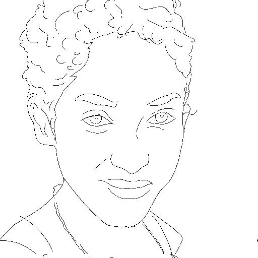
            </a> 
            
input_label

          

        </td>
        <td halign="center" style="word-wrap: break-word;" valign="top">
          

             
            
synthesized_image

          

        </td>
      </tr>
    </table>
    <h3>00000003</h3>
    <table border="1" style="table-layout: fixed;">
      <tr>
        <td halign="center" style="word-wrap: break-word;" valign="top">
          

             
            
input_label

          

        </td>
        <td halign="center" style="word-wrap: break-word;" valign="top">
          

             
            
synthesized_image

          

        </td>
      </tr>
    </table>
    <h3>00000004</h3>
    <table border="1" style="table-layout: fixed;">
      <tr>
        <td halign="center" style="word-wrap: break-word;" valign="top">
          

             
            
input_label

          

        </td>
        <td halign="center" style="word-wrap: break-word;" valign="top">
          

             
            
synthesized_image

          

        </td>
      </tr>
    </table>
    <h3>00000005</h3>
    <table border="1" style="table-layout: fixed;">
      <tr>
        <td halign="center" style="word-wrap: break-word;" valign="top">
          

            <a href="images/00000005_input_label.jpg">
              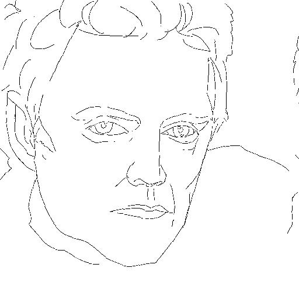
            </a> 
            
input_label

          

        </td>
        <td halign="center" style="word-wrap: break-word;" valign="top">
          

             
            
synthesized_image

          

        </td>
      </tr>
    </table>
    <h3>00000006</h3>
    <table border="1" style="table-layout: fixed;">
      <tr>
        <td halign="center" style="word-wrap: break-word;" valign="top">
          

            <a href="images/00000006_input_label.jpg">
              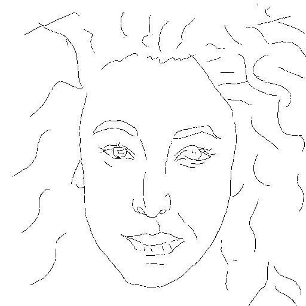
            </a> 
            
input_label

          

        </td>
        <td halign="center" style="word-wrap: break-word;" valign="top">
          

             
            
synthesized_image

          

        </td>
      </tr>
    </table>
    <h3>00000007</h3>
    <table border="1" style="table-layout: fixed;">
      <tr>
        <td halign="center" style="word-wrap: break-word;" valign="top">
          

            <a href="images/00000007_input_label.jpg">
              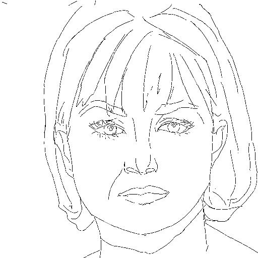
            </a> 
            
input_label

          

        </td>
        <td halign="center" style="word-wrap: break-word;" valign="top">
          

             
            
synthesized_image

          

        </td>
      </tr>
    </table>
    <h3>00000008</h3>
    <table border="1" style="table-layout: fixed;">
      <tr>
        <td halign="center" style="word-wrap: break-word;" valign="top">
          

            <a href="images/00000008_input_label.jpg">
              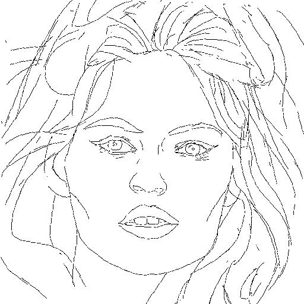
            </a> 
            
input_label

          

        </td>
        <td halign="center" style="word-wrap: break-word;" valign="top">
          

             
            
synthesized_image

          

        </td>
      </tr>
    </table>
    <h3>00000009</h3>
    <table border="1" style="table-layout: fixed;">
      <tr>
        <td halign="center" style="word-wrap: break-word;" valign="top">
          

            <a href="images/00000009_input_label.jpg">
              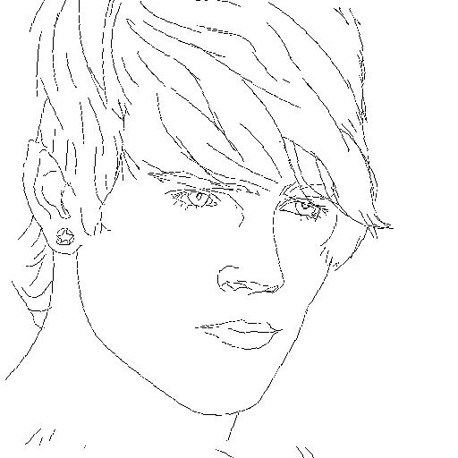
            </a> 
            
input_label

          

        </td>
        <td halign="center" style="word-wrap: break-word;" valign="top">
          

             
            
synthesized_image

          

        </td>
      </tr>
    </table>
    <h3>00000010</h3>
    <table border="1" style="table-layout: fixed;">
      <tr>
        <td halign="center" style="word-wrap: break-word;" valign="top">
          

            <a href="images/00000010_input_label.jpg">
              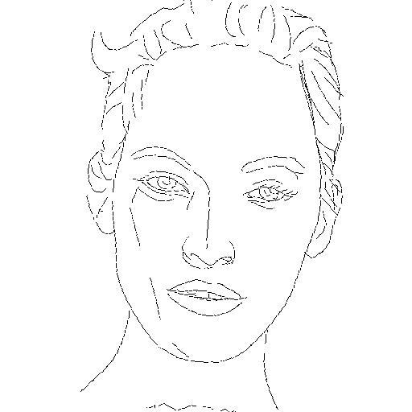
            </a> 
            
input_label

          

        </td>
        <td halign="center" style="word-wrap: break-word;" valign="top">
          

             
            
synthesized_image

          

        </td>
      </tr>
    </table>
    <h3>00000011</h3>
    <table border="1" style="table-layout: fixed;">
      <tr>
        <td halign="center" style="word-wrap: break-word;" valign="top">
          

            <a href="images/00000011_input_label.jpg">
              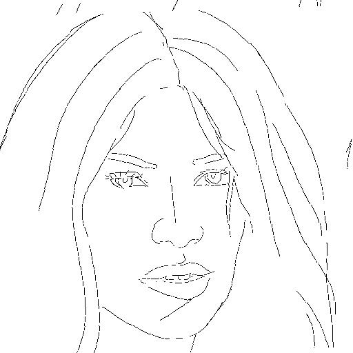
            </a> 
            
input_label

          

        </td>
        <td halign="center" style="word-wrap: break-word;" valign="top">
          

             
            
synthesized_image

          

        </td>
      </tr>
    </table>
    <h3>00000012</h3>
    <table border="1" style="table-layout: fixed;">
      <tr>
        <td halign="center" style="word-wrap: break-word;" valign="top">
          

             
            
input_label

          

        </td>
        <td halign="center" style="word-wrap: break-word;" valign="top">
          

             
            
synthesized_image

          

        </td>
      </tr>
    </table>
    <h3>00000013</h3>
    <table border="1" style="table-layout: fixed;">
      <tr>
        <td halign="center" style="word-wrap: break-word;" valign="top">
          

            <a href="images/00000013_input_label.jpg">
              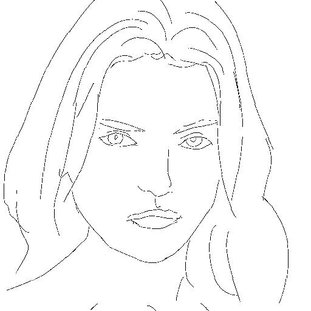
            </a> 
            
input_label

          

        </td>
        <td halign="center" style="word-wrap: break-word;" valign="top">
          

             
            
synthesized_image

          

        </td>
      </tr>
    </table>
    <h3>00000014</h3>
    <table border="1" style="table-layout: fixed;">
      <tr>
        <td halign="center" style="word-wrap: break-word;" valign="top">
          

            <a href="images/00000014_input_label.jpg">
              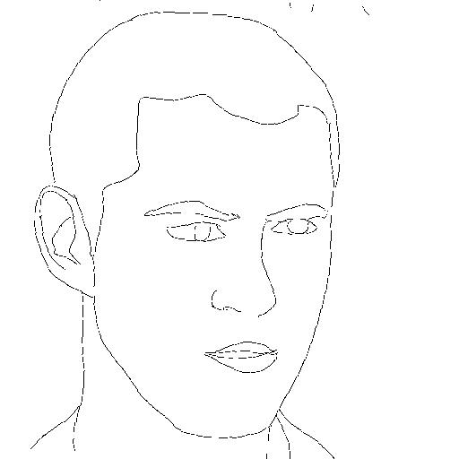
            </a> 
            
input_label

          

        </td>
        <td halign="center" style="word-wrap: break-word;" valign="top">
          

             
            
synthesized_image

          

        </td>
      </tr>
    </table>
    <h3>00000015</h3>
    <table border="1" style="table-layout: fixed;">
      <tr>
        <td halign="center" style="word-wrap: break-word;" valign="top">
          

            <a href="images/00000015_input_label.jpg">
              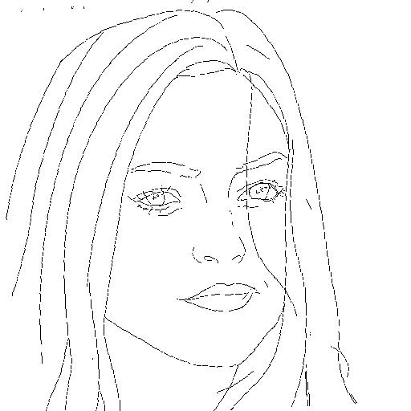
            </a> 
            
input_label

          

        </td>
        <td halign="center" style="word-wrap: break-word;" valign="top">
          

             
            
synthesized_image

          

        </td>
      </tr>
    </table>
    <h3>00000016</h3>
    <table border="1" style="table-layout: fixed;">
      <tr>
        <td halign="center" style="word-wrap: break-word;" valign="top">
          

            <a href="images/00000016_input_label.jpg">
              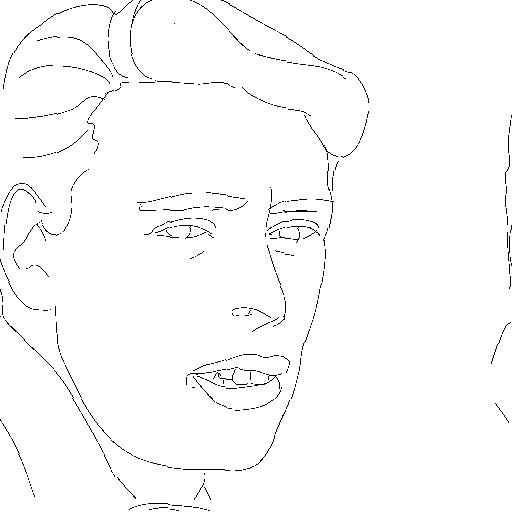
            </a> 
            
input_label

          

        </td>
        <td halign="center" style="word-wrap: break-word;" valign="top">
          

             
            
synthesized_image

          

        </td>
      </tr>
    </table>
    <h3>00000017</h3>
    <table border="1" style="table-layout: fixed;">
      <tr>
        <td halign="center" style="word-wrap: break-word;" valign="top">
          

            <a href="images/00000017_input_label.jpg">
              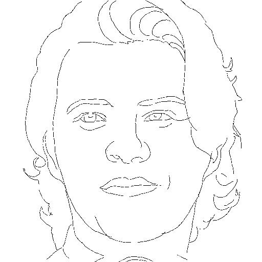
            </a> 
            
input_label

          

        </td>
        <td halign="center" style="word-wrap: break-word;" valign="top">
          

             
            
synthesized_image

          

        </td>
      </tr>
    </table>
    <h3>00000018</h3>
    <table border="1" style="table-layout: fixed;">
      <tr>
        <td halign="center" style="word-wrap: break-word;" valign="top">
          

             
            
input_label

          

        </td>
        <td halign="center" style="word-wrap: break-word;" valign="top">
          

             
            
synthesized_image

          

        </td>
      </tr>
    </table>
    <h3>00000019</h3>
    <table border="1" style="table-layout: fixed;">
      <tr>
        <td halign="center" style="word-wrap: break-word;" valign="top">
          

            <a href="images/00000019_input_label.jpg">
              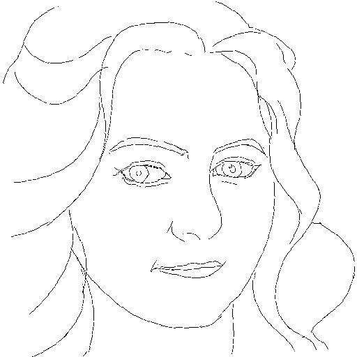
            </a> 
            
input_label

          

        </td>
        <td halign="center" style="word-wrap: break-word;" valign="top">
          

             
            
synthesized_image

          

        </td>
      </tr>
    </table>
    <h3>00000020</h3>
    <table border="1" style="table-layout: fixed;">
      <tr>
        <td halign="center" style="word-wrap: break-word;" valign="top">
          

            <a href="images/00000020_input_label.jpg">
              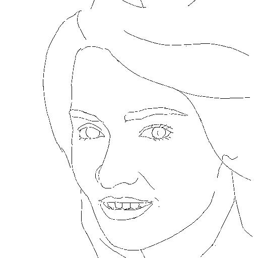
            </a> 
            
input_label

          

        </td>
        <td halign="center" style="word-wrap: break-word;" valign="top">
          

             
            
synthesized_image

          

        </td>
      </tr>
    </table>
    <h3>00000021</h3>
    <table border="1" style="table-layout: fixed;">
      <tr>
        <td halign="center" style="word-wrap: break-word;" valign="top">
          

            <a href="images/00000021_input_label.jpg">
              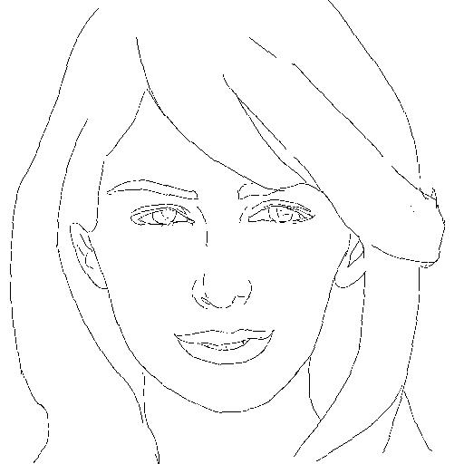
            </a> 
            
input_label

          

        </td>
        <td halign="center" style="word-wrap: break-word;" valign="top">
          

             
            
synthesized_image

          

        </td>
      </tr>
    </table>
    <h3>00000022</h3>
    <table border="1" style="table-layout: fixed;">
      <tr>
        <td halign="center" style="word-wrap: break-word;" valign="top">
          

            <a href="images/00000022_input_label.jpg">
              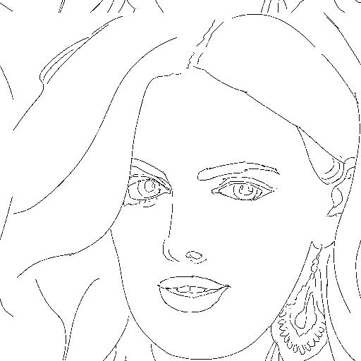
            </a> 
            
input_label

          

        </td>
        <td halign="center" style="word-wrap: break-word;" valign="top">
          

             
            
synthesized_image

          

        </td>
      </tr>
    </table>
    <h3>00000023</h3>
    <table border="1" style="table-layout: fixed;">
      <tr>
        <td halign="center" style="word-wrap: break-word;" valign="top">
          

            <a href="images/00000023_input_label.jpg">
              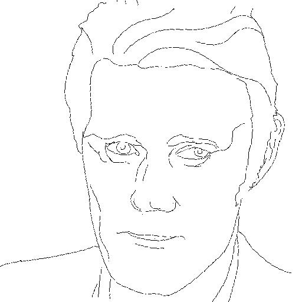
            </a> 
            
input_label

          

        </td>
        <td halign="center" style="word-wrap: break-word;" valign="top">
          

             
            
synthesized_image

          

        </td>
      </tr>
    </table>
    <h3>00000024</h3>
    <table border="1" style="table-layout: fixed;">
      <tr>
        <td halign="center" style="word-wrap: break-word;" valign="top">
          

            <a href="images/00000024_input_label.jpg">
              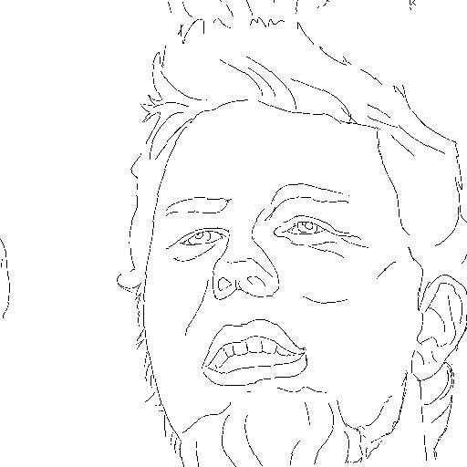
            </a> 
            
input_label

          

        </td>
        <td halign="center" style="word-wrap: break-word;" valign="top">
          

             
            
synthesized_image

          

        </td>
      </tr>
    </table>
    <h3>00000025</h3>
    <table border="1" style="table-layout: fixed;">
      <tr>
        <td halign="center" style="word-wrap: break-word;" valign="top">
          

             
            
input_label

          

        </td>
        <td halign="center" style="word-wrap: break-word;" valign="top">
          

             
            
synthesized_image

          

        </td>
      </tr>
    </table>
    <h3>00000026</h3>
    <table border="1" style="table-layout: fixed;">
      <tr>
        <td halign="center" style="word-wrap: break-word;" valign="top">
          

            <a href="images/00000026_input_label.jpg">
              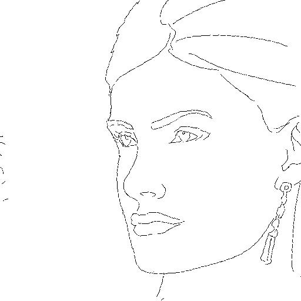
            </a> 
            
input_label

          

        </td>
        <td halign="center" style="word-wrap: break-word;" valign="top">
          

             
            
synthesized_image

          

        </td>
      </tr>
    </table>
    <h3>00000027</h3>
    <table border="1" style="table-layout: fixed;">
      <tr>
        <td halign="center" style="word-wrap: break-word;" valign="top">
          

             
            
input_label

          

        </td>
        <td halign="center" style="word-wrap: break-word;" valign="top">
          

             
            
synthesized_image

          

        </td>
      </tr>
    </table>
    <h3>00000028</h3>
    <table border="1" style="table-layout: fixed;">
      <tr>
        <td halign="center" style="word-wrap: break-word;" valign="top">
          

            <a href="images/00000028_input_label.jpg">
              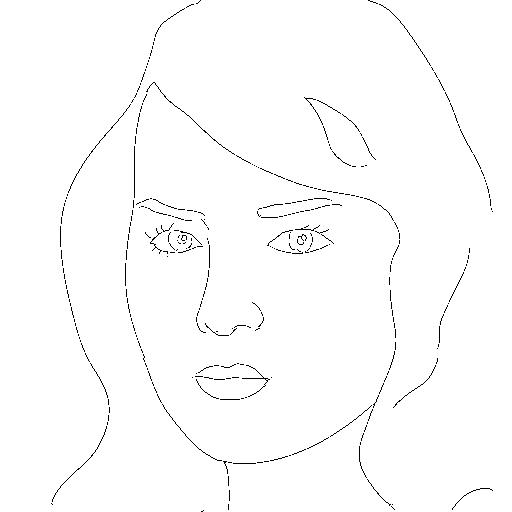
            </a> 
            
input_label

          

        </td>
        <td halign="center" style="word-wrap: break-word;" valign="top">
          

             
            
synthesized_image

          

        </td>
      </tr>
    </table>
    <h3>00000029</h3>
    <table border="1" style="table-layout: fixed;">
      <tr>
        <td halign="center" style="word-wrap: break-word;" valign="top">
          

            <a href="images/00000029_input_label.jpg">
              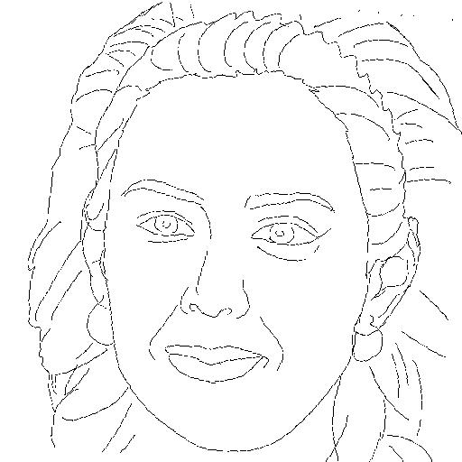
            </a> 
            
input_label

          

        </td>
        <td halign="center" style="word-wrap: break-word;" valign="top">
          

             
            
synthesized_image

          

        </td>
      </tr>
    </table>
    <h3>00000030</h3>
    <table border="1" style="table-layout: fixed;">
      <tr>
        <td halign="center" style="word-wrap: break-word;" valign="top">
          

            <a href="images/00000030_input_label.jpg">
              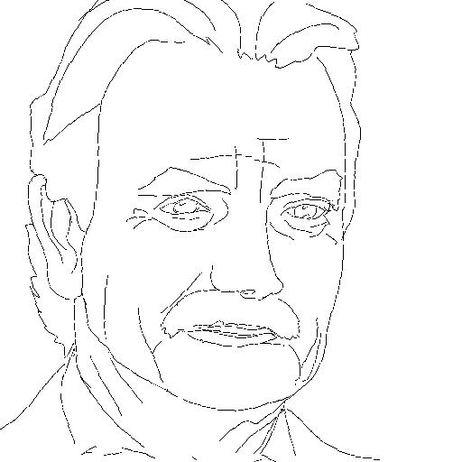
            </a> 
            
input_label

          

        </td>
        <td halign="center" style="word-wrap: break-word;" valign="top">
          

             
            
synthesized_image

          

        </td>
      </tr>
    </table>
    <h3>00000031</h3>
    <table border="1" style="table-layout: fixed;">
      <tr>
        <td halign="center" style="word-wrap: break-word;" valign="top">
          

             
            
input_label

          

        </td>
        <td halign="center" style="word-wrap: break-word;" valign="top">
          

             
            
synthesized_image

          

        </td>
      </tr>
    </table>
    <h3>00000032</h3>
    <table border="1" style="table-layout: fixed;">
      <tr>
        <td halign="center" style="word-wrap: break-word;" valign="top">
          

             
            
input_label

          

        </td>
        <td halign="center" style="word-wrap: break-word;" valign="top">
          

             
            
synthesized_image

          

        </td>
      </tr>
    </table>
    <h3>00000033</h3>
    <table border="1" style="table-layout: fixed;">
      <tr>
        <td halign="center" style="word-wrap: break-word;" valign="top">
          

            <a href="images/00000033_input_label.jpg">
              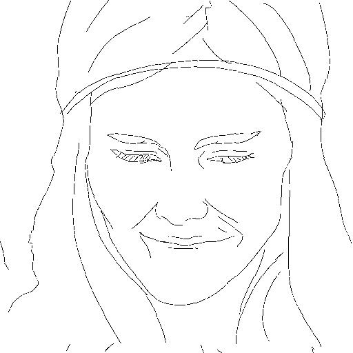
            </a> 
            
input_label

          

        </td>
        <td halign="center" style="word-wrap: break-word;" valign="top">
          

             
            
synthesized_image

          

        </td>
      </tr>
    </table>
    <h3>00000034</h3>
    <table border="1" style="table-layout: fixed;">
      <tr>
        <td halign="center" style="word-wrap: break-word;" valign="top">
          

             
            
input_label

          

        </td>
        <td halign="center" style="word-wrap: break-word;" valign="top">
          

             
            
synthesized_image

          

        </td>
      </tr>
    </table>
    <h3>00000035</h3>
    <table border="1" style="table-layout: fixed;">
      <tr>
        <td halign="center" style="word-wrap: break-word;" valign="top">
          

            <a href="images/00000035_input_label.jpg">
              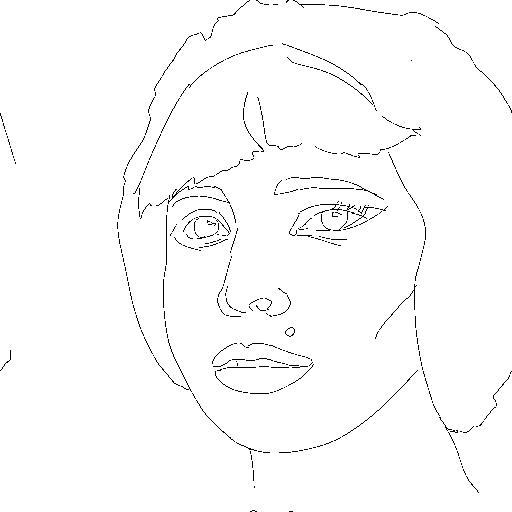
            </a> 
            
input_label

          

        </td>
        <td halign="center" style="word-wrap: break-word;" valign="top">
          

             
            
synthesized_image

          

        </td>
      </tr>
    </table>
    <h3>00000036</h3>
    <table border="1" style="table-layout: fixed;">
      <tr>
        <td halign="center" style="word-wrap: break-word;" valign="top">
          

            <a href="images/00000036_input_label.jpg">
              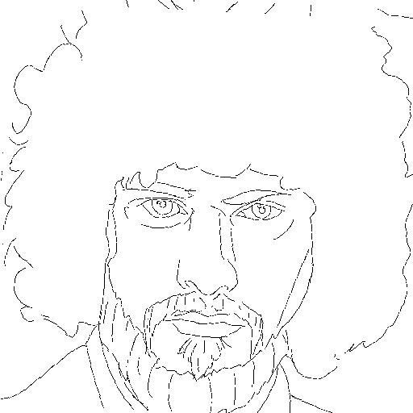
            </a> 
            
input_label

          

        </td>
        <td halign="center" style="word-wrap: break-word;" valign="top">
          

             
            
synthesized_image

          

        </td>
      </tr>
    </table>
    <h3>00000037</h3>
    <table border="1" style="table-layout: fixed;">
      <tr>
        <td halign="center" style="word-wrap: break-word;" valign="top">
          

             
            
input_label

          

        </td>
        <td halign="center" style="word-wrap: break-word;" valign="top">
          

             
            
synthesized_image

          

        </td>
      </tr>
    </table>
    <h3>00000038</h3>
    <table border="1" style="table-layout: fixed;">
      <tr>
        <td halign="center" style="word-wrap: break-word;" valign="top">
          

            <a href="images/00000038_input_label.jpg">
              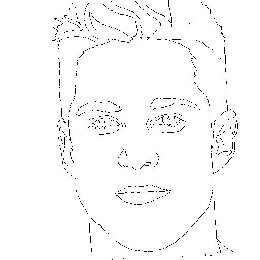
            </a> 
            
input_label

          

        </td>
        <td halign="center" style="word-wrap: break-word;" valign="top">
          

             
            
synthesized_image

          

        </td>
      </tr>
    </table>
    <h3>00000039</h3>
    <table border="1" style="table-layout: fixed;">
      <tr>
        <td halign="center" style="word-wrap: break-word;" valign="top">
          

             
            
input_label

          

        </td>
        <td halign="center" style="word-wrap: break-word;" valign="top">
          

             
            
synthesized_image

          

        </td>
      </tr>
    </table>
    <h3>00000040</h3>
    <table border="1" style="table-layout: fixed;">
      <tr>
        <td halign="center" style="word-wrap: break-word;" valign="top">
          

            <a href="images/00000040_input_label.jpg">
              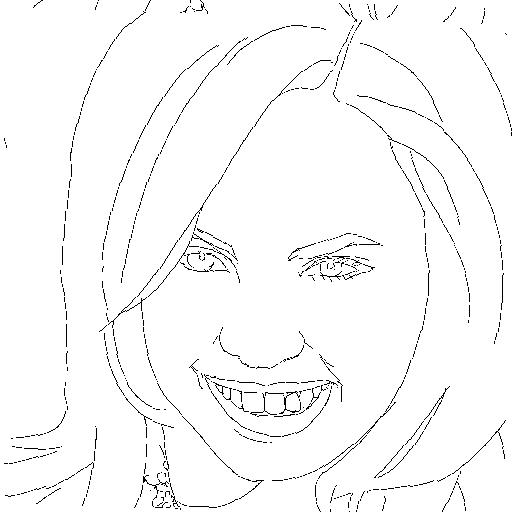
            </a> 
            
input_label

          

        </td>
        <td halign="center" style="word-wrap: break-word;" valign="top">
          

             
            
synthesized_image

          

        </td>
      </tr>
    </table>
    <h3>00000041</h3>
    <table border="1" style="table-layout: fixed;">
      <tr>
        <td halign="center" style="word-wrap: break-word;" valign="top">
          

            <a href="images/00000041_input_label.jpg">
              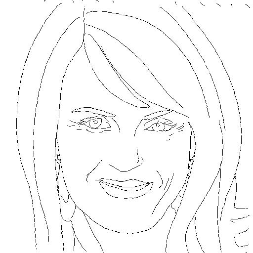
            </a> 
            
input_label

          

        </td>
        <td halign="center" style="word-wrap: break-word;" valign="top">
          

             
            
synthesized_image

          

        </td>
      </tr>
    </table>
    <h3>00000042</h3>
    <table border="1" style="table-layout: fixed;">
      <tr>
        <td halign="center" style="word-wrap: break-word;" valign="top">
          

            <a href="images/00000042_input_label.jpg">
              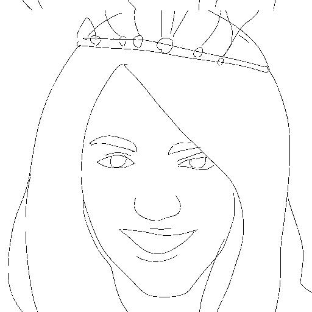
            </a> 
            
input_label

          

        </td>
        <td halign="center" style="word-wrap: break-word;" valign="top">
          

             
            
synthesized_image

          

        </td>
      </tr>
    </table>
    <h3>00000043</h3>
    <table border="1" style="table-layout: fixed;">
      <tr>
        <td halign="center" style="word-wrap: break-word;" valign="top">
          

            <a href="images/00000043_input_label.jpg">
              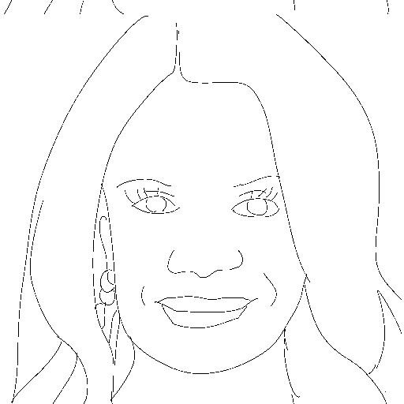
            </a> 
            
input_label

          

        </td>
        <td halign="center" style="word-wrap: break-word;" valign="top">
          

             
            
synthesized_image

          

        </td>
      </tr>
    </table>
    <h3>00000044</h3>
    <table border="1" style="table-layout: fixed;">
      <tr>
        <td halign="center" style="word-wrap: break-word;" valign="top">
          

            <a href="images/00000044_input_label.jpg">
              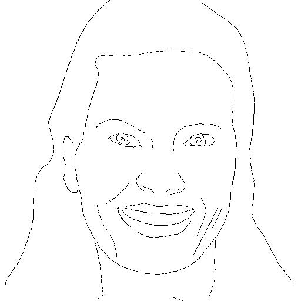
            </a> 
            
input_label

          

        </td>
        <td halign="center" style="word-wrap: break-word;" valign="top">
          

             
            
synthesized_image

          

        </td>
      </tr>
    </table>
    <h3>00000045</h3>
    <table border="1" style="table-layout: fixed;">
      <tr>
        <td halign="center" style="word-wrap: break-word;" valign="top">
          

            <a href="images/00000045_input_label.jpg">
              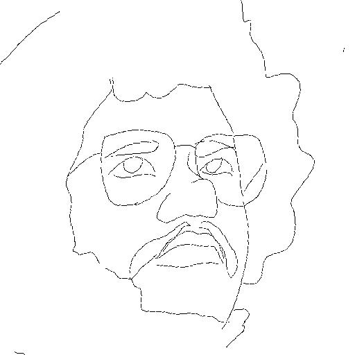
            </a> 
            
input_label

          

        </td>
        <td halign="center" style="word-wrap: break-word;" valign="top">
          

             
            
synthesized_image

          

        </td>
      </tr>
    </table>
    <h3>00000046</h3>
    <table border="1" style="table-layout: fixed;">
      <tr>
        <td halign="center" style="word-wrap: break-word;" valign="top">
          

            <a href="images/00000046_input_label.jpg">
              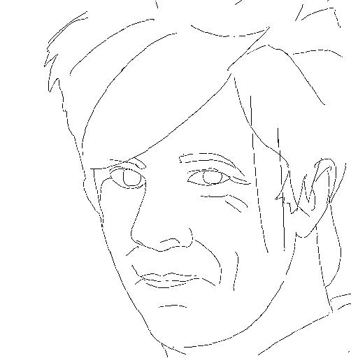
            </a> 
            
input_label

          

        </td>
        <td halign="center" style="word-wrap: break-word;" valign="top">
          

             
            
synthesized_image

          

        </td>
      </tr>
    </table>
    <h3>00000047</h3>
    <table border="1" style="table-layout: fixed;">
      <tr>
        <td halign="center" style="word-wrap: break-word;" valign="top">
          

            <a href="images/00000047_input_label.jpg">
              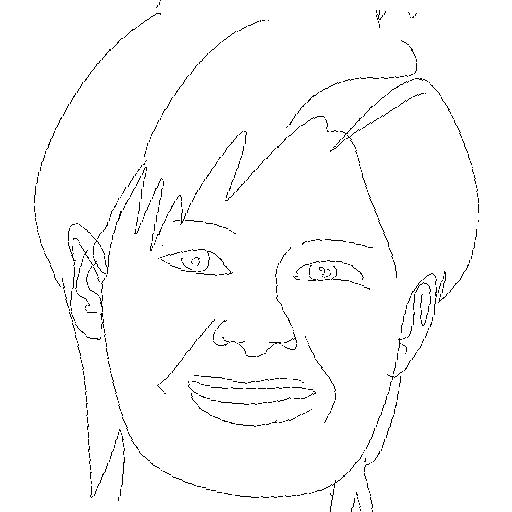
            </a> 
            
input_label

          

        </td>
        <td halign="center" style="word-wrap: break-word;" valign="top">
          

             
            
synthesized_image

          

        </td>
      </tr>
    </table>
  </body>
</html>